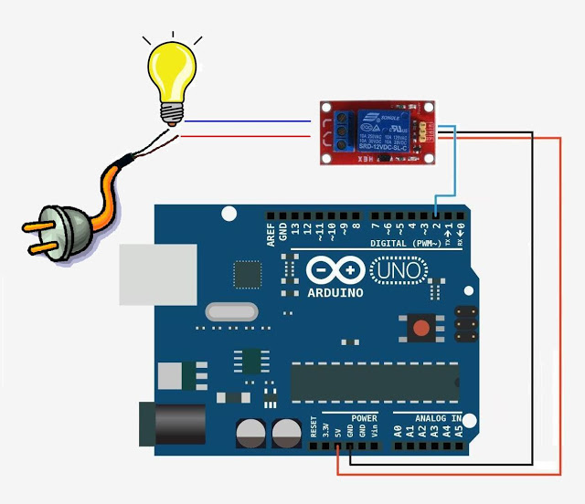

# ArduinoBasico

# CEP de úbeda

## 9 de Febrero, 2 y 10 de Marzo de 2016

José Antonio Vacas @javacasm

# Programando con [Bitbloq](http://bitbloq.bq.com)

### http://bitbloq.bq.com

Bitbloq es un entorno de programación visual que nos permite hacer pogramas para Arduino sin tener conocimientos de programación.

Un programa estará formado un conjunto de bloques que encajan entre sí.

Los bloques están agrupados en familias, cada una de ellas con un color concreto.

# Minicurso Bitbloq

Bitbloq es un entorno de programación visual que nos permite crear programas para Arduino y placas compatibles y transferir los mismos a las placas de una forma sencilla.

Podemos acceder directamente desde su web  http://bitbloq.bq.com/
(Pudiera ocurrir que algunos vídeos se usa la versión anterior, que era la recomendada hasta hace poco ...)

Funciona mejor con Chrome en todos los sistemas operativos, y al usarlo te dirá si necesitas drivers o instalar algún complemento en tu sistema

A lo largo de estos vídeos veremos algunas de sus características más importantes.

## Introducción a la programacion con bitbloq:

[[vídeo]](https://youtu.be/rOdMRhhQTUs) [[ejemplo
Parpadeo]](https://raw.githubusercontent.com/javacasm/ArduinoBasico/blob/master/bitbloq/1.%20parpadeo.json)

### Usaremos el led interno

Bitbloq es un entorno de programación visual por bloques que nos permite programar nuestra placa arduino o compatible de forma sencilla, evitando la complejidad de las sentencias C++

Además nos permite programar nuestro arduino sin instalar (practicamente) nada en nuestro ordenador

Empezaremos seleccionando el tipo de placa Arduino que vamos a usar y a continuación añadiremos el hardware que usemos conectándolo a las patillas correspondientes.

#### Ejercicio: Cambiar la velocidad de parpadeo

* * *

## Con led externo

### Montaje sencillo

[detalle led](imagenes/300px-LED.png)

* * *
### Montaje con placa prototipo

[¿cómo funciona una placa prototipo?](imagenes/breadboard1.gif)

#### Ejercicio: Cambiar el pin utilizado al pin 2

* * *

### Esquema eléctrico

* * *

## Con un relé usaremos ¡¡grandes corrientes eléctricas!!

* * *

### Ver código C++ de un programa bitbloq:  
[[video]](https://youtu.be/cg1YNVSprdo)

Desde bitbloq siempre podemos ver el codigo Arduino generado. De momento no podemos modificar este código pero si copiarlo y llevarlo al IDE de arduino

### Transfiriendo el programa bitbloq a Arduino
[[vídeo]](https://youtu.be/95oW-hOX9pc)

Bitbloq nos permite programar nuestro arduino sin instalar (practicamente) nada en nuestro ordenador. Sólo tenemos que pulsar sobre el botón cargar lo que hace que se compile el código, se detecte la placa y se envíe el programa a naestro Arduino

Para aprender las funciones de pin en bitbloq  
[[vídeo]](http://youtu.be/zKs0-vwoxMM)

Las funciones de pin son las distintas formas que tenemos de manejar los pines de arduino. Tenemos las mismas sentencias que en arduino (en el menú Funciones de Pin): DigitalWrite, AnalogWrite, DigitalRead y AnalogRead. También podemos usarlas si utilizamos un bloque ZUM o octopus correspondiente. ????

#### Ejercicio: Cambiar al pin del esquema

* * *
## Veamos un poco de código

	void setup()  				// Función de configuración
	{
	  pinMode(13,OUTPUT);  		// Vamos a usar una salida
	}

	void loop()  // Función de bucle. Se repite por siempre
	{
	  digitalWrite(13,HIGH);  	// Activamos la salida 13
	  delay(1000);				// Esperamos
	  digitalWrite(13,LOW);		// Desativamos la salida 13
	  delay(1000);				// Esperamos
	}							// Cuando termina se vuelve a llamar

#### Ejercicio: Cambiar al pin del esquema
#### Ejercicio: Cambiar el pin utilizado al pin 2

* * *
# Envío de datos serie

### La comunicación serie se produce via USB entre Arduino y el PC

* Detectamos el puerto
* Configuramos la velocidad
* Necesitamos un programa para ver los datos

## Vamos a enviar "Encendido" y "Apagado" al PC

* * *
# Escritura de valores analógicos

## Usando técnicas como PWM podemos simular valores intermedios: 0 - 255
### (sólo en algunos pines ~ )

## Como vamos a hacer que cambie de valor usaremos una variable

### Si vemos el código

	void setup()						// configuracion
	{
	  pinMode(9,OUTPUT);				// Usaremos la patilla 5 como salida
	  Serial.begin(9600);				// Configuramos la conexión con el PC
	}

	void loop()
	{
	  int valorSalida=0;				// la variable valorSalida empieza en 0
	  while (valorSalida < 256) {		// Haremos el bucle hasta que llegemos a 256
	    analogWrite(9,valorSalida);		// pasamos el valor a la patilla 5
	    Serial.println(valorSalida);	// Enviamos al pc la variable
	    delay(100);						// Esperamos 0,1 segundos
	   }

	}

* * *
# Led RGB
## 3 leds (Red,Green,Blue) con una de las patillas común

## Positivo (Ánodo) Común

## Negativo (Cátodo) Común

## Tiras de leds: Necesitamos más potencia por lo que usaremos un transistor como amplificador.

### El montaje es sencillo

## Sentencias de control

[[video]](https://youtu.be/dakh7MTxpBg)

Las sentencias de control son aquellas que nos permite modificar el orden o el modo en el que se ejecutan los bloques de nuestro programa

### Variables

Para utilizar las sentencias de control necesitaremos el concepto de variables: que no es otra cosa que un lugar donde almacenar un valor que puede se modificar si así lo queremos

[[video]](https://youtu.be/Os-8oHBKsQU)

Con las variables podemos realizar operaciones matemáticas

[[video]](https://youtu.be/nvRUCZERScE)  [[ejemplo]](https://raw.githubusercontent.com/javacasm/ArduinoBasico/master/bitbloq/operaciones%20variables.json)

### Bucle **for**
[[vídeo]](https://youtu.be/mIAgTdc4oC8) [[ejemplo]](https://raw.githubusercontent.com/javacasm/ArduinoBasico/master/bitbloq/bucle%20for.json)

El bucle **for** permite repetir un conjunto de pasos un número de veces determinado.
Necesitamos  declarar una variables que actuará como contador y definir el valor inicial que tendrá la variable y el final, realizándose tantos como pasos como valores enteros haya entre ambas.

### Bucle **while**
[[vídeo]](https://youtu.be/RVcaaz1NYjk) [[ejemplo]](https://raw.githubusercontent.com/javacasm/ArduinoBasico/master/bitbloq/bucle%20while.json)

Usaremos la sentencia de control **while** para los bucles donde el número de veces que se repite no está definido desde el principio

### Bloque **if** : sentencias condicionales
[[vídeo]](https://youtu.be/RTtn_77pZY4	) [[ejemplo]](https://raw.githubusercontent.com/javacasm/ArduinoBasico/master/bitbloq/condiconales.json)

Las sentencias condicionales permiten ejecutar un código y otro según se cumpla o no una determinada condición. Esta condición será una validación que definiremos con operandos.

Podemos hacer que en caso de que se cumpla se ejecute un código (es el bloque if) y en caso de que no se cumpla la condición se ejecute otro (bloque else). Veamos un ejemplo

[[video]](https://youtu.be/-f_htl5TQN8)[[ejemplo]](https://raw.githubusercontent.com/javacasm/ArduinoBasico/master/bitbloq/condicional%20compleja.json)

### Condicionales complejas
[[vídeo](http://youtu.be/en_Y-_wVyO0)]
[][ejemplo](./ejemplosBitbloq/condiciones_if.xml)]

La condición que determina si se ejecuta un bloque u otro o si salimos de un bloque while puede contener varias comprobaciones.

Entre estas condiciones utilizaremos operadores lógicos que pueden ser AND o OR

* Estas condiciones se tendrán que cumplir todas en el caso del operador AND

* Con que se cumpla una de elllas se dará por válida toda la condición

## Envío de datos al PC:
[[vídeo]](https://youtu.be/hy9t76RLeBU) [[ejemplo]](https://raw.githubusercontent.com/javacasm/ArduinoBasico/master/bitbloq/comunicacion%20serie.json)

Podemos enviar contenidos entre nuestra placa y el PC usando las sentencias de comunicaciones. Usaremos print para enviar algo (puede ser el valor de una variable o un texto) al pc o println para enviar y pasar a la siguiente línea.

## Variables locales vs Variables globales

[vídeo](https://youtu.be/U3ulo7rAE58) [ejemplo](https://raw.githubusercontent.com/javacasm/ArduinoBasico/master/bitbloq/variables%20globales.json)

Podemos definir variables locales o globales. Una variable global estará definida y por tanto mantendrá su valor en todo el programa, mientras que una variable local solo se definirá donde se haya declarado.

Las variables globales mantienen su valor entre las distintas iteraciones que se realizan del programa.

## Ejemplo de bucle sin sentencias de control ???

[[ejemplo]](https://raw.githubusercontent.com/javacasm/ArduinoBasico/master/bitbloq/ejemplo%20bucle%20arduino.json)

Podemos usar la forma cíclica (y unas variables globales) en la que se ejecutan los programas en Arduino para hacer un bucle sin más estructuras de control que una simple variable global

### Sonido

En bitbloq existen 2 formas de generar sonidos

* Reproducir notas musicales: podemos escoger la nota que vamos a reproducir y su duración

* ¿¿¿¿¿ Seleccionar la frecuencia exacta que queremos reproducir y su duración ???

 [[ejemplo]](https://raw.githubusercontent.com/javacasm/ArduinoBasico/master/bitbloq/sonido.json)

## ¿¿¿¿¿ Librerías ????

En el caso de Bitbloq, ahora mismo no se pueden usar librerías, de forma manual.

### Servo

 [[ejemplo]](./ejemplosBitbloq/Servo.xml)

Para usar la librería Servo con bitbloq podemos usar los bloques Servo. Existen 2 tipos de servos: los de rotación continua y los normales.

## Entradas y salidas digitales

Veamos como podemos usar las entradas y salidas digitales

[[video]](https://youtu.be/GmvUamkeG4Y) [[ejemplo]](https://raw.githubusercontent.com/javacasm/ArduinoBasico/master/bitbloq/pines%20digitales.json)

Veamos ahora como activar un led al pulsar un botón. Para ello añadiremos un botón y un led en el apartado del hardware

[[ejemplo]](https://raw.githubusercontent.com/javacasm/ArduinoBasico/master/bitbloq/entradaysalidadigital.json)

## Entradas analógicas

[[video]](https://youtu.be/nChCA1Qc0uo)[[ejemplo]](https://raw.githubusercontent.com/javacasm/ArduinoBasico/master/bitbloq/entrada%20analogica.json)

Veamos como leer las entradas digitales

## ¿¿¿¿ Salidas analógicas (PWM) ????

 [[ejemplo]](./ejemplosBitbloq/Salida_Analogica.xml)

Puedes encontrar más tutoriales en la página [oficial de bitbloq](http://diwo.bq.com/tag/bitbloq-2/)
