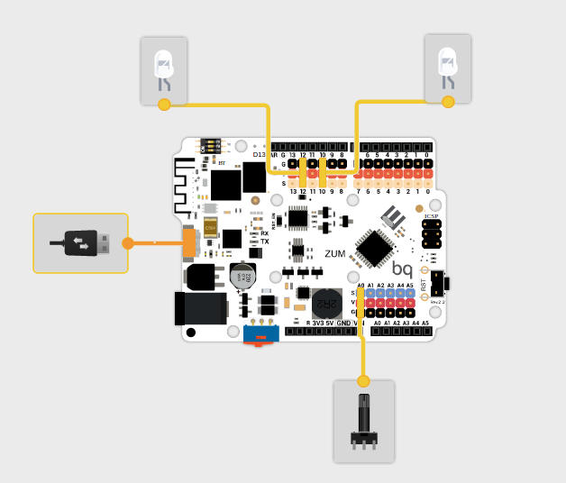

# Parpadeando

1. Empezamos con 1 led Parpadeando

1. Ahora vamos hacer que parpadean 2 Leds

1. Controlemos ahora la Velocidad de parpadeo usando un potenciómuestreo

Usaremos este Hardware

y este Programa

donde:

1. Encendemos en alternancia
1. Leemos el valor de un potenciómetro
1. Hemos declarado unas variables para reusar el valor y no tener que leer varias veces
1. Calculamos el voltaje que tendrá el pin A0 con la fórmula

v=lectura*5.0/1023

(hay que recordar la importancia de hacer el cálculo con número decimales)
1. Enviamos datos al PC

# Voltímetro

Vamos a añadir al ejemplo anterior la medida de voltaje.

1. Calculamos el voltaje que tendrá el pin A0 con la fórmula

v=lectura*5.0/1023

(hay que recordar la importancia de hacer el cálculo con número decimales)
1. Enviamos datos al PC

# Termostato

Vamos a simular un termostato con un potenciómetro.

1. Leeremos un valor analógico, que simulará una temperatura.
1. En función del valor leído, activaremos una salida, que simula el sistema de frío u otra que simulará el sistema de calor. Si quisieramos hacer el sistema realmente, bastaría conectar un relé a cada salida.

## Programa

Coneptos:
* Umbral.
* Histéresis: importancia de dejar unos márgenes de tolerancia.
* Funciones condicionales simples y complejas.

# Semáforo

## Pasos

1. Empezamos por un semáforo con 2 luces (usaremos verde y azul)

1. Añadimos un servo para bloquear el paso (podemos hacer una maqueta)
  * Concepto de librería
  * Control de servo
[Proyecto](http://goo.gl/jkFhcs)

### Hardware

1. Queremos añadir un botón para decidir cuando cambia. Basta con activar el cambio cuando se activa el pulsador

1. Ahora vamos a añadir un sensor de paso que lanzará una alarma cuando se active. Vemos que la espera nos complica todo...
  * Debemos de romper la espera larga en esperas más pequeñas
  * Usaremos un bucle de repetición determinista: for
  
TODO: Maqueta (¿modelo 3D?)

# Seguidor solar

1. ¿qué es un Seguidor Solar?

1. Componentes
  * Montaje
  * LDR (concepto de sensores)
  * Leds como indicadores
  * Servo como indicador

1. Programa
  * Conceptos:
    * Calibración
    * Offset
    * Velocidad de muestreo

TODO: Maqueta (¿modelo 3D?)
